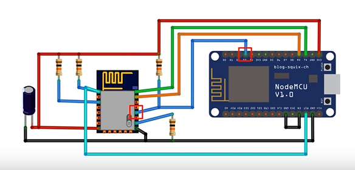

# Sismin_ESP12f
Berikut merupakan sistem minimum ESP-12F yang telah saya coba dengan upload program melalui NodeMCU Lolin.
   
Saat upload pilih Board: "Generic ESP8266 Module" dan jangan lupa pilih port yang sesuai. Berikut hasil test Blink LED buildin di ESP-12F.
   

